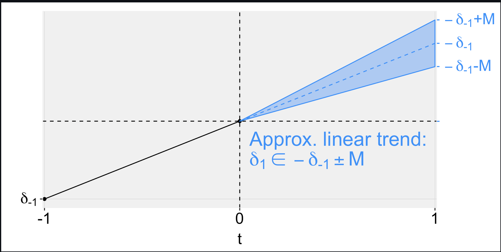
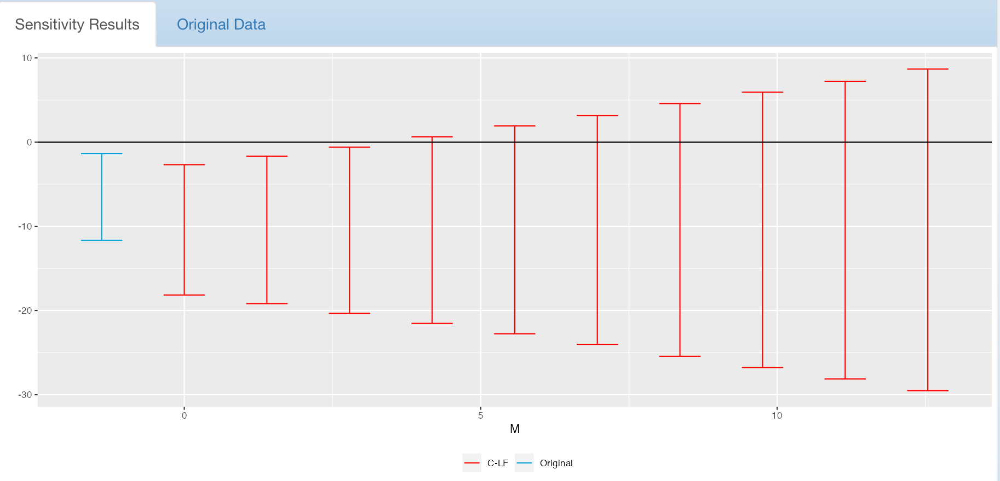
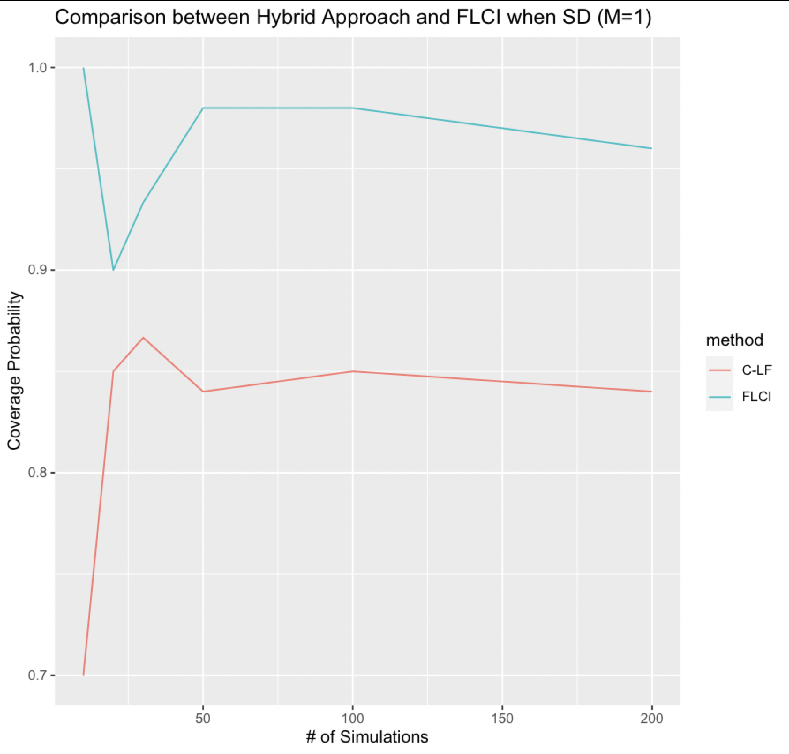
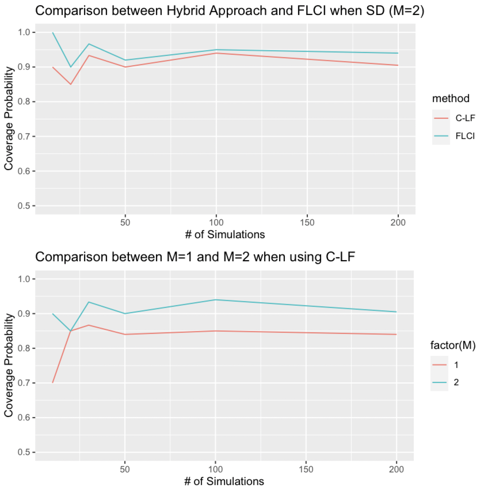
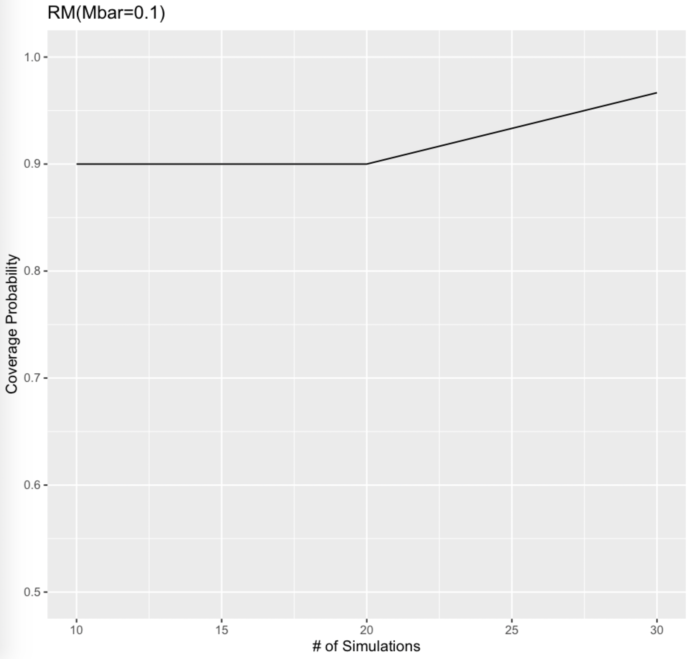

# Limitation of Pre-trend Testing^[Roth, J.(2022), Pretest with Caution: Event-Study Estimates after Testing for Parallel Trends, American Economic Review: Insights, 4 (3), 305–322]

  1. 🙅 Low Power: Pre-trend test may fail to detect violations of parallel trends.
  2. 🙅 Distortion: Selection bias from only analyzing cases with insignificant pre-trend.
  3. 🙅 Parametric approaches to controlling for pre-existing trends are Sensitive to functional form.
  
         💁 What if pre-trend test fails? Could we still make valid inference? 

# Revisiting Parallel Trends
  - "Event-study" coefficients: $\hat{\beta}=(\hat{\beta}^{\prime}_{pre},\hat{\beta}^{\prime}_{post})^{\prime} \in \mathbb{R}^{\underline{T}+\bar{T}}$
  - Under mild regularity, $\sqrt{n}(\hat{\beta}_{n}-\beta)\sim \mathcal{N}(0,\Sigma^{\star})$
  - Causal Decomposition:
  $$\beta=\underbrace{\left( \begin{array}{c} \tau_{pre} \\ \tau_{post} \end{array} \right)}_{=:\tau}+\underbrace{\left( \begin{array}{c} \delta_{pre} \\ \delta_{post} \end{array} \right)}_{=:\delta}$$
    - No anticipation: $\tau_{pre}=0$
    - Under Parallel Trends: $\delta_{post}=0 \Longrightarrow  \beta_{post}=\tau_{post}$
    - Otherwise, $\beta_{post} \not= \tau_{post}$
    
  <!-- 📚 Example: Non-staggered DiD -->

  <!-- \begin{align*} -->
  <!-- \beta_s &=& \mathbb{E}[Y_{is}(1)-Y_{i0}(0)|D_i=1]-\mathbb{E}[Y_{is}(0)-Y_{i0}(0)|D_i=0]\\ -->
  <!-- &=& \tau_{ATT,s}+\underbrace{\mathbb{E}[Y_{is}(0)-Y_{i0}(0)|D_i=1]-\mathbb{E}[Y_{is}(0)-Y_{i0}(0)|D_i=0]}_{\delta_s} -->
  <!-- \end{align*} -->
  
# Intuition

{width=700px}

General Idea: Sensitivity of causal conclusions to alternative assumptions on the possible violations of parallel trends

# Identified Set of Target Paramter when Parallel Trends fail

 - Under $\delta \in \Delta \not= \{\delta: \delta_{post}=0\}$, the identified set of target parameter $\theta:=l^{\prime}\tau_{post}$:

  $$\mathcal{S}(\beta,\Delta):=\left\{ \theta: \exists \delta \in \Delta, \tau_{post} \in \mathbb{R}^{\bar{T}} \quad \textrm{s.t.} \quad l^{\prime}\tau_{post}=\theta, \beta= \delta+\left( \begin{array}{c} 0 \\ \tau_{post} \end{array} \right)\right\}$$
  
  - **Lemma 2.1**: If $\Delta$ is closed and convex set, then $\mathcal{S}(\beta,\Delta)$ is an interval in $\mathbb{R}$, $\mathcal{S}(\beta,\Delta)=[\theta^{lb}(\beta,\Delta), \theta^{ub}(\beta,\Delta)]$, where 
  
  \begin{align*}
  \theta^{lb}(\beta,\Delta) &=& l^{\prime}\beta_{post}-\left(\max_{\delta} l^{\prime} \delta_{post}, \quad \textrm{s.t.} \quad \delta \in \Delta, \delta_{pre}=\beta_{pre} \right)\\
  \theta^{ub}(\beta,\Delta) &=& l^{\prime}\beta_{post}-\left(\min_{\delta} l^{\prime} \delta_{post}, \quad \textrm{s.t.} \quad \delta \in \Delta, \delta_{pre}=\beta_{pre} \right)
  \end{align*}
  
  - Additionally, if $\Delta$ is the finite union of sets, $\Delta=\cup_{k=1}^{K}\Delta_k$, then
  
  $$\mathcal{S}(\beta,\Delta)=\cup_{k=1}^K \mathcal{S}(\beta, \Delta_k)$$
  But, this doesn't hold true for intersection of sets. Easy to prove when taking $\mathcal{S}(\beta,\Delta)$ as a function of $\Delta$.
  
# Possible choices of $\Delta$
 
  1. **Bounding Relative Magnitudes**: 
  $$\Delta^{RM}(\bar{M}):=\{\delta: \forall t \ge 0, |\delta_{t+1}-\delta_t|\le \bar{M}\cdot \max_\limits{s<0} |\delta_{s+1}-\delta_s|\}$$
  2. **Smoothness restrictions**: 
  $$\Delta^{SD}(M):=\{\delta: |(\delta_{t+1}-\delta_t)-(\delta_{t}-\delta_{t-1})|\le M, \forall t\}$$
  3. **Combining the two restrictions above**: 
  $$\Delta^{SDRM}(\bar{M}):=\{\delta: \forall t \ge 0, |(\delta_{t+1}-\delta_t)-(\delta_{t}-\delta_{t-1})|\le \bar{M}\cdot \max_\limits{s<0} |(\delta_{s+1}-\delta_s)-(\delta_{s}-\delta_{s-1})|\}$$
  4. **Sign restrictions** *(take positive sign as an example)*: 
  $$\Delta^{PB}:=\{\delta:\delta_t \ge 0 \quad \forall t\ge0\}$$ 
  5. **Monotonicity restrictions** *(take increasing monotonicity  as an example)*: 
  $$\Delta^{I}:=\{\delta:\delta_t \ge \delta_{t-1} \quad \forall t\}$$ 
  <!-- 6. Monotonicity restrictions and Sign restrictions may be combined with Bounding Relative Magnitudes and Smoothness restrictions. -->
  
# Wrap-up all possible $\Delta$: Polyhedral restrictions

  👏 All restrictions discussed can be wrapped up in a nutshell of **Polyhedral restrictions** or a finite unions of such restrictions.
  $$\Delta=\{\delta: A\delta \le d\}$$
  for some known matrix $A$ and vector $d$.
  
  📚 Example Again: $\Delta^{SD}(M)$ in three period DiD setting
  
  $$\Delta^{SD}(M):=\{\delta: |(\delta_{1}-\delta_0)-(\delta_{0}-\delta_{-1})|\le M\}$$
  Equally, $\Delta^{SD}(M):=\{\delta: A^{SD}\delta \le d^{SD}\}$ for $A^{SD}=\left( \begin{array}{cc} 1&1 \\ -1&-1 \end{array} \right)$ and $d^{SD}=(M,M)^{\prime}$
  
# Inferential Goal: Confidence Set with Uniform Validness

  - Under mild regularity, "Event-study" coefficients will satisfy $\sqrt{n}(\hat{\beta}_{n}-\beta)\sim \mathcal{N}(0,\Sigma^{\star})$.
  - Equally, $\hat{\beta}_n \approx_{d} \mathcal{N}(\beta, \Sigma_n)$ where $\Sigma_n=\Sigma^{\star}/n$
  - To construct confidence set $\mathcal{C}_n(\hat{\beta}_n, \Sigma_n)$ that are uniformly valid for **all** parameter values $\theta$ in the identified set.
  $$\inf_\limits{\delta \in \Delta}\inf_\limits{\theta \in \mathcal{S}(\delta+\tau, \Delta)}\mathbb{P}_{\hat{\beta}_n \sim \mathcal{N}(\delta+\tau, \Sigma_n)}\bigg(\theta \in \mathcal{C}_n(\hat{\beta}_n, \Sigma_n)\bigg)\ge 1-\alpha$$
  
  - **Lemma 2.2**: If confidence set $\mathcal{C}_{n,k}(\hat{\beta}_n, \Sigma_n)$ satisfies uniform valideness shown above with $\Delta=\Delta_k$. Then, $\mathcal{C}_{n}(\hat{\beta}_n, \Sigma_n)=\cup_{k=1}^K\mathcal{C}_{n,k}(\hat{\beta}_n, \Sigma_n)$ also satisfies uniform validness with $\Delta=\cup_{k=1}^K\Delta_k$.

# How to Get such a Confidence Set?

## 1️⃣ Inference using Moment Inequalities

## 2️⃣ Inference using Fixed Length Confidence Intervals

# Inference using Moment Inequalities

## Defining null hypothesis and rewriting it as a moment inequality problem

  - Recall: Target parameter $\theta:=l^{\prime}\tau_{post}$ and Polyhedral restriction $\Delta=\{\delta: A\delta \le d\}$
  - To develop tests that have exact size $\alpha$ under the following null hypothesis when normal approximation $\hat{\beta}_n \approx_{d} \mathcal{N}(\beta, \Sigma_n)$ hold exactly with known variance matrix $\Sigma_n$.
  $$\fbox{$H_0: \theta=\bar{\theta}, \delta\in \Delta$}$$
  
  - By using  $\hat{\beta}_n \sim \mathcal{N}(\beta, \Sigma_n)$ and defining $Y_n=A\hat{\beta}_n-d$ and $L_{post}=[0,I]^{\prime}$, $H_0$ is rewritten as:
  $$\fbox{$H_0: \exists \tau_{post} \in \mathbb{R}^{\bar{T}} \quad \textrm{s.t.} \quad l^{\prime}\tau_{post}=\bar{\theta} \quad \textrm{and} \quad \mathbb{E}_{\hat{\beta}_n \sim \mathcal{N}(\beta, \Sigma_n)}[Y_n-AL_{post}\tau_{post}]\le0$}$$
  
  - The d.f. of $\tau_{post}$ is $\bar{T}-1$, so it will be useful to further rewrite $H_0$ with an unrestricted nuisance parameter $\tilde{\tau}$ of dimension $\bar{T}-1$. By changing the basis of matrix $AL_{post}$,we can rewrite $AL_{post}\tau_{post}$ as $\tilde{A}(\theta,\tilde{\tau}^{\prime})^{\prime}$ for $\tilde{\tau}\in \mathbb{R}^{\bar{T}-1}$. Thus, by further defining $\tilde{Y}_n(\bar{\theta})=Y_n-\tilde{A}_{(\cdot,1)}\bar{\theta}$ and $\tilde{X}=\tilde{A}_{(\cdot,-1)}$, $H_0$ is further equivalent to:
  $$\fbox{$H_0: \exists\tilde{\tau}\in \mathbb{R}^{\bar{T}-1}, \textrm{s.t.} \mathbb{E}\big[\tilde{Y}_n(\bar{\theta})-\tilde{X}\tilde{\tau}\big]\le0$}$$
  
# Inference using Moment Inequalities

  - $\tilde{\tau}$ may be of **high dimension**, and many methods rely on test inversion over a grid for the full parameter vector, thus making them computationally infeasible. Here, **conditional and hybrid approaches**^[Andrews, Isaiah, Jonathan Roth, and Ariel Pakes (2022), Inference for Linear Conditional Moment Inequalities, Forthcoming, Review of Economic Studies] are introduced, the optimal local asymptotic power of which has been proved under certain conditions.
  
# Inference using Moment Inequalities

## Constructing conditional confidence sets

  - For some fixed $\bar{\theta}$, the conditional approach considers tests based on the following statistic:
  $$\hat{\eta}:=\min_\limits{\eta,\tilde{\tau}}\eta \quad \textrm{s.t.} \quad \tilde{Y}_n(\bar{\theta})-\tilde{X}\tilde{\tau}\le \tilde{\sigma}_n\cdot \eta \quad \textrm{,where} \quad \tilde{\sigma}_n=\sqrt{\textrm{diag}(\tilde{\Sigma}_n)} \quad ❗ \textrm{Explain} \quad \hat{\eta} $$
  
  - Dual Problem (Recall from Schweizer's math): 
  $$\hat{\eta}=\max_\limits{\gamma} \gamma^{\prime}\tilde{Y}_n(\bar{\theta}) \quad \textrm{s.t.} \quad \gamma^{\prime}\tilde{X}=0, \quad \gamma^{\prime}\tilde{\sigma}_n=1, \quad \gamma\ge0$$
  
   If $\gamma_{\star}$ is optimal in dual problem, it is a vector of Lagrangian multipliers in primal problem. 
   
   - To construct critical values, they use the fact that $\hat{\eta}$ has a **truncated normal distribution** conditional on the event that $\gamma_{\star}$ is optimal in the dual problem. Specifically,
   $$\fbox{$\hat{\eta}| \{\gamma_{\star} \in \hat{V}_n, S_{n}=s\}\sim \xi| \xi \in [v^{lo},v^{up}]$}$$
   
   where $\xi\sim \mathcal{N}\big(\gamma^{\prime}_{\star}\tilde{\mu}(\bar{\theta}),\gamma^{\prime}_{\star}\tilde{\Sigma}_n\gamma_{\star}\big)$, $\tilde{\mu}(\bar{\theta})=\mathbb{E}\big[\tilde{Y}_n(\bar{\theta})\big]$, $\hat{V}_n \subset V(\Sigma_n)$,$S_n=(I-\frac{\tilde{\Sigma}_n\gamma_{\star}}{\gamma^{\prime}_{\star}\tilde{\Sigma}_n\gamma_{\star}}\gamma^{\prime}_{\star})\tilde{Y}_n(\bar{\theta})$ and $v^{lo}$, $v^{up}$ are known functions of $\tilde{\Sigma}_n$,$s$ and $\gamma_{\star}$.

# Inference using Moment Inequalities

## Constructing conditional confidence sets

  - Under null, $\gamma^{\prime}_{\star}\tilde{\mu}(\bar{\theta})=\gamma^{\prime}_{\star}(\tilde{\mu}(\bar{\theta})-\tilde{X}\tilde{\tau}) \le 0$, because **dual problem** implies $\gamma_{\star}\ge0$ and $\gamma^{\prime}_{\star}\tilde{X}=0$ and **$H_0$** implies that $\exists \tilde{\tau} \quad \textrm{s.t.} \quad \tilde{\mu}(\bar{\theta})-\tilde{X}\tilde{\tau}\le0$.
  - Then, **Critical Value**: **$\max\{0,c_{C,\alpha}\}$**, where $c_{C,\alpha}$ is $1-\alpha$ quantile of truncated normal distribution under the **worst-case** that $\gamma^{\prime}_{\star}\tilde{\mu}(\bar{\theta})=0$. 
  - By denoting $\psi_{\alpha}^{C}(\hat{\beta}_n,A,d,\bar{\theta},\Sigma_n)$ an indicator for whether the conditional test rejects $H_0$, then Confidence Set: $\mathcal{C}^{C}_{\alpha,n}(\hat{\beta}_n,\Sigma_n):=\{\bar{\theta: \psi_{\alpha}^{C}(\hat{\beta}_n,A,d,\bar{\theta},\Sigma_n)=0}\}$. The construction of conditional test guarantees **finite-sample coverage requirement (size control)**.
  $$\forall \delta\in\Delta, \mathbb{E}_{\hat{\beta}_n \sim \mathcal{N}(\delta+\tau, \Sigma_n)}\big[\psi_{\alpha}^{C}(\hat{\beta}_n,A,d,l^{\prime}\tau_{post},\Sigma_n)\big]\le \alpha$$

  - A problem with **Conditional approach**. Explain it with an example: $\bar{T}=1$, $\tilde{\Sigma}_n=I$, then $\hat{\eta}=\max_j \tilde{Y}_{n,j}$,i.e., the max component of $\tilde{Y}_n$, $v^{lo}=\max_{j\not=\hat{j}} \tilde{Y}_{n,j}$,i.e., the second max, $v^{up}=\infty$. 
  
  ⭕ Case 1: In population, one moment is violated and others are very slack,i.e., $\tilde{\mu}_1>0$ while $\tilde{\mu}_j \ll 0$ for $j \not=1$. 
  
  ❌ Case 2: $\mu_1 \approx \mu_2 >0$. Low in power.

# Inference using Moment Inequalities

## Constructing hybrid confidence sets

  - Solution to the problem in Case 2: a **"hybrid"** test that combines the **conditional approach** with a test based on **"least-favorable(LF)"** assumption that $\tilde{\mu}(\bar{\theta})=0$. Two stages:
  
  1️⃣ A size-$\kappa$ (Usually $\kappa=\alpha/10$) LF test that rejects whenever $\hat{\eta}$ exceeds the $1-\kappa$ quatile of $\max_{\gamma\in V(\Sigma)}\gamma^{\prime}\xi$, where $\xi\sim \mathcal{N}(0,\tilde{\Sigma}_n)$. The "hybrid" approach rejects if size-$\kappa$ rejects. Otherwise, proceed to stage 2.
  
  2️⃣ A size-$\big(\frac{\alpha-\kappa}{1-\kappa}\big)$ conditional test that also conditions on the event that the first stage LF test did not reject. By defining $v^{up}_H=\min\{v^{up}, c_{LF,\kappa}\}$, we have:
  $$\hat{\eta}| \{\gamma_{\star} \in \hat{V}_n, S_{n}=s, \hat{\eta}\le c_{LF,\kappa}\}\sim \xi| \xi \in [v^{lo},v^{up}_H]$$
  
  - **"Hybrid"** approach improves the power of test for case 2, while maintaining the power for case 1. Finite-sample size control is also guaranteed.

# Inference using Moment Inequalities

## Asymptotic Properties

  Besides finite sample size control, following asymptotic properties of *conditional and hybrid* approaches have been proven.
  
 - **Uniform asymptotic size control** under certain assumptions.
 - **Uniform asymptotic consistency** under certain assumptions, i.e., power against fixed alternatives outside the identified set converges uniformly to 1 .
 - **Optimal local asymptotic power** under certain assumptions (importantly, Linear Independence Constraint Qualification),i.e., the limit (as the sample size diverges) of the rejection probability under the local alternative.

# Inference using Fixed Length Confidence Intervals

  - Even though **Conditional and Hybrid Approaches** have attractive asymptotic power guarantees in which sampling variation grows small relative to the length of identified set, FLCI has finite-sample power guarantees for certain classes of restrictions.

# Inference using Fixed Length Confidence Intervals

## Constructing FLCIs

  - They consider FLCI based on an affine estimator for $\theta$, denoted by $\mathcal{C}_{\alpha,n}(a,v,\chi):= (a+v^{\prime}\hat{\beta_n})\pm\chi$. The **target** is to minimize $\chi$, subject to that $\mathcal{C}_{\alpha,n}(a,v,\chi)$ satisfies the finite-sample coverage requirement.
  
  $$\hat{\beta}_n \sim \mathcal{N}(\beta,\Sigma_n)$$
  
  $\Longrightarrow |a+v^{\prime}\hat{\beta}_n-\theta|\sim |\mathcal{N}(b,v^{\prime}\Sigma_nv)|$, where $b=a+v^{\prime}\hat{\beta_n}-\theta$$
  
  $\Longrightarrow \theta \in \mathcal{C}_{\alpha,n}(a,v,\chi) \quad \textrm{iff} \quad |a+v^{\prime}\hat{\beta}_n-\theta|\le\chi$
  
  $\Longrightarrow$ For fixed $a$ and $v$, the smallest $\chi$ that satisfies coverage requirement is $1-\alpha$ quantile of $|\mathcal{N}(\bar{b},v^{\prime}\Sigma_nv)|$, where $\bar{b}$ is the worst case bias. 
  
  $\Longrightarrow$ $\chi_n(a,v,\alpha)=\sigma_{v,n}\cdot cv_{\alpha}(\bar{b}(a,v)/\sigma_{v,n})$, where $cv_{\alpha}(t)$ is $1-\alpha$ quantile of $|\mathcal{N}(t,1)|$ and $\sigma_{v,n}:=\sqrt{v^{\prime}\Sigma_nv}$.
  
  $\Longrightarrow$ $\mathcal{C}_{\alpha,n}^{FLCI}(\hat{\beta}_n,\Sigma_n):=(a_n+v_n^{\prime}\hat{\beta}_n)\pm\chi_n$, where $\chi_n:=\inf_{a,v}\chi_n(a,v,\alpha)$

# Inference using Fixed Length Confidence Intervals

## Finite Sample near Optimality

  - They prove that FLCI has finite-sample power guarantee only when 1) $\delta$ is convex and centrosymmetric and 2) $\delta \in \Delta$ is such that $(\tilde{\delta}-\delta)\in \Delta$ for all $\tilde{\delta} \in \Delta$. In all possible choices of $\Delta$ discussed earlier, only $\Delta^{SD}(M)$ satisfies these conditions.
  
## (In)Consistency of FLCIs

  - Likewise, they prove that consistency of FLCI doesn't hold for $\Delta$ that doesn't satisfy those conditions.

# Application

## Sensitivity Analysis

  - **Set-up**: $\beta$ and $\hat{\Sigma}$ from Bailey and Goodman-Bacon (2015)^[Bailey, M.J. and Goodman-Bacon, A. (2015),The War on Poverty’s Experiment in Public Medicine: Community Health Centers and the Mortality of Older Americans, American Economic Review, 105 (3), 1067–1104]; Target Parameter: $\tau_{1,post}$; Restriction: $\Delta^{SD}(M)$; Method: Hybrid; $\alpha=0.05$
  - I created a **shiny app** with which users can interactively create sensitivity analysis for all 12 papers discussed in Rambachan and Roth (2022).
  
{width=700px}
  
  - **Conclusion**: We can reject a null effect unless we are willing to allow for the linear extrapolation across consecutive periods to be off by more than 2.79 percentage points.
  
# Simulation

## Finite-sample Properties

  - Further **Set-up**: Simulate $\hat{\beta}_s \sim \mathcal{N}(\beta,\hat{\Sigma})$; According to results of sensitivity analysis, $M=\{0.1,1\}$ for $\Delta^{SD}(M)$; $\bar{M}=0.1$ for $\Delta^{RM}(\bar{M})$. I also constructed FLCI in case of $\Delta^{SD}(M)$ to compare with conditional hybrid approach.

  {width=600px}

# Simulation

## Finite-sample Properties

 {width=600px}
 

# Simulation

## Finite-sample Properties

 {width=600px}

# Additional Resources
 
 - [YouTube Video](https://www.youtube.com/watch?v=F8C1xaPoRvM): Jonathan Roth "Testing and Sensitivity Analysis for Parallel Trends"
 - HonestDiD packages: [R](https://github.com/asheshrambachan/HonestDiD) and [Stata](https://github.com/mcaceresb/stata-honestdid#honestdid)
 - All materials for this presentation can be found on my [GitHub](https://github.com/ccfang2/TopicsMetricsStats2022WiSe)

# Thank you!

**Contact**: 

Twitter: 

GitHub: 

